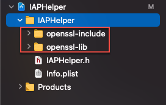
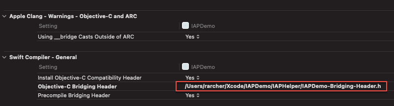

# In-App Purchase Helper
In-App Purchase Helper, including support for on-device receipt validation

**Disclaimer**. The source code presented here is for educational purposes. You may freely reuse and amend this code for use in your own apps. 
However, you do so entirely at your own risk.

## See **IAPDemo** on [GitHub](https://github.com/russell-archer/IAPDemo) for an example of how to use `IAPHelper`.

## Updated 31st December 2020
Added notes on [Support for Strong Customer Authentication transactions in the European Economic Area](#Support-for-Strong-Customer-Authentication-transactions-in-the-European-Economic-Area) 
with reference to new a [Apple Support Document](https://developer.apple.com/support/psd2/). 

---

# In-App Purchases with Xcode 12 and iOS 14

References: 
* [In-App Purchase Overview](https://developer.apple.com/in-app-purchase/) (Apple)
* [Receipt Validation Programming Guide](https://developer.apple.com/library/archive/releasenotes/General/ValidateAppStoreReceipt/Chapters/ValidateLocally.html#//apple_ref/doc/uid/TP40010573-CH1-SW2) (Apple archive but still useful)
* [In-App Purchase](https://developer.apple.com/documentation/storekit/in-app_purchase) (Apple)
* [Choosing a Receipt Validation Technique](https://developer.apple.com/documentation/storekit/in-app_purchase/choosing_a_receipt_validation_technique) (Apple)
* [Validating Receipts with the App Store](https://developer.apple.com/documentation/storekit/in-app_purchase/validating_receipts_with_the_app_store) (Apple)
* [In-App Purchases: Receipt Validation Tutorial](https://www.raywenderlich.com/9257-in-app-purchases-receipt-validation-tutorial) (Ray Wenderlich)
* [Local Receipt Validation for iOS in Swift From Start to Finish](https://www.andrewcbancroft.com/2017/08/01/local-receipt-validation-swift-start-finish/) (Andrew Bancroft)
* [Swifty Local Receipt Validator](https://github.com/andrewcbancroft/SwiftyLocalReceiptValidator) (Andrew Bancroft)
* [Receipt Validation – Verifying a Receipt Signature in Swift](https://www.andrewcbancroft.com/2017/07/16/receipt-validation-verifying-a-receipt-signature-in-swift/) (Andrew Bancroft)
* [Receipt Validation](https://www.objc.io/issues/17-security/receipt-validation/) (Laurent Etiemble, Objc)

---

# Contents
* [Overview](#Overview)
* [Receipt validation options](#Receipt-validation-options)
    * [Server-side validation](#Server-side-validation)
    * [On-device validation](#On-device-validation)
    * [Third-party receipt validation service](#Third-party-receipt-validation-service) 
    * [No receipt validation](#No-receipt-validation)
* [Sandbox accounts](#Sandbox-accounts)
* [Basic Steps](#Basic-Steps)
    * [Create an IAP helper class](#Create-an-IAP-helper-class)
    * [Define your ProductIds](#Define-your-ProductIds)
    * [Add your IAPHelper to the Payment Queue](#Add-your-IAPHelper-to-the-Payment-Queue)
    * [Request localized product information from the App Store](#Request-localized-product-information-from-the-App-Store)
    * [Present the localized product list to the user and handle purchases](#Present-the-localized-product-list-to-the-user-and-handle-purchases) 
    * [Process the App Store Receipt](#Process-the-App-Store-Receipt)
    * [Xcode 12 Improvements](#Xcode-12-Improvements)
* [HelloIAPWorld Example](#HelloIAPWorld-Example)
    * [Create the App](#Create-the-App)
    * [Add the StoreKit Framework](#Add-the-StoreKit-Framework)
    * [Create the StoreKit configuration file](#Create-the-StoreKit-configuration-file) 
    * [Add the in-app purchase capability](#Add-the-in-app-purchase-capability)
    * [Enable StoreKit Testing via the Project Scheme](#Enable-StoreKit-Testing-via-the-Project-Scheme) 
    * [Add the StoreKit public certificate](#Add-the-StoreKit-public-certificate)
    * [Minimal IAPHelper Code](#Minimal-IAPHelper-Code)
    * [Running the app](#Running-the-app)
* [How to Validate Receipts Locally](#How-to-Validate-Receipts-Locally)
    * [What actually is a Receipt?](#What-actually-is-a-Receipt?)
    * [When should you validate the Receipt?](#When-should-you-validate-the-Receipt?) 
    * [Overview of the steps to validate a receipt](#Overview-of-the-steps-to-validate-a-receipt) 
    * [Key StoreKit Features](#Key-StoreKit-Features)
* [IAPDemo Example](#IAPDemo-Example)
    * [IAPHelper](#IAPHelper)
    * [OpenSSL](#OpenSSL)
    * [Loading the Receipt](#Loading-the-Receipt) 
    * [Reading In-App Purchase Records](#Reading-In-App-Purchase-Records)
    * [Validating the Receipt](#Validating-the-Receipt)
* [StoreKit Automated Testing](#StoreKit-Automated-Testing)
    * [Overview](#Overview)
    * [What is a Workspace?](#What-is-a-Workspace?)
    * [Create the IAPHelper Framework](#Create-the-IAPHelper-Framework)
    * [Combine the IAPDemo project and the IAPHelper framework in a Workspace](#Combine-the-IAPDemo-project-and-the-IAPHelper-framework-in-a-Workspace)
    * [Add Unit Tests for IAPHelper to the framework](#Add-Unit-Tests-for-IAPHelper-to-the-framework)
* [Future Enhancements](#Future-Enhancements)

---

# Overview
The code we write to manage in-app purchases is critically important to the success of our apps. However, if you’ve not tackled it before, implementing and 
testing in-app purchases is daunting, complex and seems *way* more involved than you’d expect!

Anybody wanting to support in-app purchases faces a similar set of challenges:

- How do you define the set of products that can be purchased in your app?
- Defining your in-app purchases in App Store Connect
- Working with `StoreKit` to request *localized* product data from the App Store and initiate purchases
- Implementing `StoreKit` delegate methods to process async notifications for purchase success, failure, restoring purchases, etc.
- Handling edge-cases, like when a purchase is deferred because it requires parental permissions, or when entitlements for a user have changed and access to the specified IAPs has been revoked
- Should you handle App Store receipt validation on-device or server-side?
- Should you write your own receipt validation code or use a service like [RevenueCat](https://www.revenuecat.com/)?
- Working with **OpenSSL** and the arcane **PKCS #7** and **ASN.1** data structures found in receipts
- Writing code to validate the receipt and read in-app purchase data
- Creating and managing sandbox accounts used for testing

When I first implemented in-app purchases in one of my iOS apps in 2016 the two main pain-points were:

- [Receipt validation options](#Receipt-validation-options)
- [Sandbox accounts](#Sandbox-accounts)

# Receipt validation options

The App Store issues an encrypted receipt when in-app purchases are made or restored (when an app’s first installed, no receipt is present). 
This receipt contains a complete list of all in-app purchases made in the app. 

There are four receipt validation approaches available:

1. Server-side receipt validation
2. On-device receipt validation
3. Third-party receipt validation service
4. No receipt validation

## Server-side validation
This is probably the easiest option, but you need an app server to send requests to the App Store server. Apple specifically says you **should not** create direct 
connections to the App Store server from your app because you can’t guard against man-in-the-middle attacks. 

Despite this clear warning, the web has many examples (including commercial offerings) of using direct app-to-App Store connections. The advantage of using 
server-side validation is that you can retrieve easily decoded JSON payloads that include all the in-app purchase data you need. We don’t cover server-side 
validation in this example.

## On-device validation
On-device validation is somewhat tricky and requires use of the C-based [OpenSSL](https://www.openssl.org/) library to decrypt and read the receipt data. 
Note that including the required two OpenSSL libraries adds nearly 50MB to your app.

I first started supporting in-app purchases in 2016. I fully expected **StoreKit** or some other Apple framework to provide ready-to-use abstractions allowing 
for easy access to the low-level cryptographic data structures in the receipt. However, as I looked deeper into the “where’s the receipt processing framework?” 
conundrum the more the answer became clear: having a ready-to-use framework creates a security risk because “hackers” wishing to access your in-app 
purchases for-free know in advance where and how to concentrate their attacks. Apple’s answer was (*and still is*): create your own custom receipt validation 
solution because a unique solution will be harder to hack.

Clearly a custom solution (if done correctly) will be more secure. But, as all developers know that have attempted it, writing security-critical cryptographic-related 
code is **hard** and if you get it wrong disasters will happen! In my opinion, surely it would be better for Apple to provide something that enables correct and 
*reasonably secure* receipt validation for the general app developer?

However, at present (November 2020) you have no choice if you want to validate and read receipt data on-device: you must develop your own OpenSSL-based 
solution. If you don’t feel confident doing this feel free to adapt (or use as-is) the code presented herein.

## Third-party receipt validation service
A number of third parties provide receipt validation services, normally as part of a larger in-app purchase, subscription and analytics service. I've not used any 
of them in my apps so can't comment on their suitability. However, [RevenueCat](https://www.revenuecat.com/) seems like a good option judging by their 
documentation and sample code. 

## No receipt validation
It’s perfectly possible to do no receipt validation at all, if you think that’s appropriate for your app’s business model. All you need to do is handle transactions 
from the App Store using the following method:

```swift
paymentQueue(_:updatedTransactions:)
```

When you get a `.purchased` or `.restored` transaction simply add the product identifier for the product to a list of purchased products that your app maintains. 
The list should be persisted in a database, or even `UserDefaults`. Clearly, this is a far less secure approach than doing receipt validation. However, you may 
decide that a particular app doesn’t warrant the greater protection and associated complexity provided by receipt validation. See the 
[HelloIAPWorld](#HelloIAPWorld-Example) example below for a discussion of this approach.

# Sandbox accounts
Prior to Xcode 12, in order to test in-app purchases you needed to create multiple sandbox test accounts in App Store Connect. Each sandbox account has to have 
a unique email address and be validated as an AppleID. In addition, tests must be on a real device, not the simulator.

On the test device you need to sign out of your normal AppleID and sign-in using the sandbox account. This really means you need a spare device to do testing on. 
To make things more painful, each time you make a purchase using a sandbox account that account becomes “used up” and can’t be used to re-purchase the 
same product. There’s no way to clear purchases, so you need to use a fresh sandbox account for each set of product purchases.

# Basic Steps
There are a lot of pieces that fit together to enable you to support in-app purchases in your app:


The basic steps you need to take to support in-app purchases (IAP hereafter) in your app are as follows:


## Create an IAP helper class
Create a class or struct that will contain all your IAP-related code. For the sake of example we’ll refer to this as the `IAPHelper` code.

## Define your ProductIds
Define a set of Strings that hold **ProductIds** for the products you want to sell. ProductIds are generally in reverse domain form (“com.your-company.your-product”). 
For example, `com.rarcher.flowers-large`. These ids will match the product ids you define in App Store Connect.

## Add your `IAPHelper` to the Payment Queue
To receive notifications from the App Store (when payments are successful, fail, are restored, etc.) add your IAPHelper to the StoreKit payment queue. 
This should be done as soon as possible in the app’s lifecycle. 

For example in `application(_:didFinishLaunchingWithOptions:)`, so that notifications from the App Store are not missed:

```swift
SKPaymentQueue.default().add(iapHelper)
```

## Request localized product information from the App Store
The `SKProductsRequestDelegate` method `productsRequest(_:didReceive:)` will be called asynchronously with a list of `SKProduct` objects. 
Note that you can’t simply use predefined product data because you need to display prices, etc. that are *localized* for each user.

## Present the localized product list to the user and handle purchases
When the user taps on “buy product” you should wrap the selected `SKProduct` in an `SKPayment` object, then add it to the `SKPaymentQueue`. 
The App Store will then send notifications to the `SKPaymentTransactionObserver` method `paymentQueue(_:updatedTransactions)` as the 
purchase progresses. Note that the App Store presents the user with all the required purchase prompts and confirmations.

## Process the App Store Receipt
The App Store will create a new **receipt** when a purchase has been made or restored. The receipt is available when the `paymentQueue(_:updatedTransactions)` 
method is called. This receipt, which is cryptographically signed and encrypted, contains a complete record of all the IAPs made by the user of your app.

The code discussed in the [HelloIAPWorld](#HelloIAPWorld-Example) example below provides a practical example of the above points (receipt validation is covered later).

## Xcode 12 Improvements


Immediately before Apple’s WWDC 2020 keynote event I tweeted that I was hoping for something “magical and unexpected”. I followed this up with 
“How about an update to StoreKit that makes it really easy to do on-device validation of App Store receipts”. 

Well, I didn’t get my wish with regard to receipt validation, but I certainly got something magical and unexpected related to StoreKit and in-app purchases!

Starting with Xcode 12, there’s a new local `StoreKit` test environment that allows you to do early testing of IAPs in the simulator and without having to set 
anything up in App Store Connect. You can define your products locally in a `StoreKit` Configuration file. Furthermore, you can view and delete transactions, 
issue refunds, and a whole lot more. There’s also a new `StoreKitTest` framework that enables you to do automated testing of IAPs. 
The [HelloIAPWorld](#HelloIAPWorld-Example) project below includes details on how to create and use a StoreKit configuration file.


These new features are a huge leap forward in terms of making testing substantially easier, quicker to setup, more flexible and less frustrating!

# HelloIAPWorld Example
The following example shows how to create a **very minimal IAP example** (the IAP equivalent of “Hello World”) that makes use of the new StoreKit testing 
features in Xcode 12.

Note that StoreKit testing requires **Xcode 12** and **iOS 14**.

Although this is a bare-bones example, the project does demonstrate most of the essential requirements for handling in-app purchases in an iOS app.

You can find the code for **HelloIAPWorld** [on GitHub](https://github.com/russell-archer/HelloIAPWorld).


Note that this example project is missing some features a real-world app would be expected to support:

- The App Store receipt is not validated, nor is IAP data read from the receipt
- Purchases are not persisted. So, if the app’s closed and restarted no purchases are remembered
- There’s no way to restore previous purchases
- Deferred purchases aren’t supported
- Edge cases are not supported (refunds, entitlements being revoked, store front changes, purchasing IAPs directly from the app store, etc.)

For this example we’ll assume you’re going to create a demo app from scratch using iOS 14 and Xcode 12. Here are the steps we'll go through:

- [Create the App](#Create-the-App)
- [Add the StoreKit Framework](#Add-the-StoreKit-Framework)
- [Create the StoreKit configuration file](#Create-the-StoreKit-configuration-file)
- [Add the in-app purchase capability](#Add-the-in-app-purchase-capability)
- [Enable StoreKit Testing via the Project Scheme](#Enable-StoreKit-Testing-via-the-Project-Scheme)
- [Add the StoreKit public certificate](#Add-the-StoreKit-public-certificate)
- [Minimal IAPHelper Code](#Minimal-IAPHelper-Code)
- [Running the app](#Running-the-app)

## Create the App
Create a new iOS app in Xcode named "HelloIAPWorld":


As we'll be creating the UI programmatically we need to remove the Storyboard.

Remove the name (“Main”) of the storyboard in **Targets > General > Deployment Info**:


Delete **Main.storyboard** and move it to the trash:


Open **Info.plist**, search for **Main** and then remove the **Storyboard Name** entry entirely:


Open **SceneDelegate.swift** and modify the `scene(_:willConnectTo:options:)` method as follows:

```swift
class SceneDelegate: UIResponder, UIWindowSceneDelegate {
    
    var window: UIWindow?

    func scene( _ scene: UIScene, 
                willConnectTo session: UISceneSession, 
                options connectionOptions: UIScene.ConnectionOptions) {
                
        // Use this method to optionally configure and attach the UIWindow `window` to the 
        // provided UIWindowScene `scene`. If using a storyboard, the `window` property will 
        // automatically be initialized and attached to the scene.

        // Get the window scene
        guard let windowScene = (scene as? UIWindowScene) else { return }  
        
        // Create a window
        window = UIWindow(frame: windowScene.coordinateSpace.bounds)  
       
        if let w = window {
            // Assign the window scene to the window's window scene
            w.windowScene = windowScene  
            
            // Set the root view controller (to the default view controller)
            w.rootViewController = ViewController() 
            
            // Make the window visible
            w.makeKeyAndVisible()  
        }
    }
    :
    :
}
```

## Add the StoreKit Framework
The first thing you need to do after creating your new app is to add the **StoreKit** framework. Select your app **Target** and the **General** tab, then 
add the `StoreKit` framework:


## Create the StoreKit configuration file
Now create a StoreKit configuration file. Select **File > New > File** and choose the **StoreKit Configuration File** template:


Choose a location in your project to save the file.

Open the StoreKit configuration file and click **+** to add an in-app purchase. For this example select the **Add Non-Consumable in-App Purchase** option:


You can now define your products in the StoreKit configuration file:


In this example I set the following fields:

- **Reference Name**<br/>
A descriptive name for the product

- **Product ID**<br/>
This the unique code used to identify an IAP product. This same ID will be used in App Store Connect when setting up in-app purchases for production. 
Note that Product ID is a string that, by convention, uses the format “com.developer.product”, although it can be anything you like

- **Price**<br/>
A hard-coded price for the product. In production your app will request localized price (and other) information from the App Store

By default, the first localization is for the US store. However, you can add as many localizations as required.

Note that none of the data defined in the .storekit file is ever uploaded to App Store Connect. It’s only used when testing in-app purchases locally in Xcode.

## Add the in-app purchase capability
It’s easy to forget to do this! And you can successfully test in-app purchases *without* adding the IAP capability. However, you will receive the following 
error when attempting to archive a project in preparation for uploading it to the App Store:


Add the in-app purchase capability by selecting the app target and **Signing & Capabilities**, then click **+** **Capability** to add a capability:


## Enable StoreKit Testing via the Project Scheme
You now need to enable StoreKit testing in Xcode (it’s disabled by default).

Select **Product > Scheme > Edit Scheme**. Now select **Run** and the **Options** tab. You can now select your configuration file from 
the **StoreKit Configuration** list:


Should you wish to disable StoreKit testing then repeat the above steps and remove the StoreKit configuration file from the **StoreKit Configuration** list.

## Add the StoreKit public certificate
You need to add the StoreKit public test certificate to your project. This isn’t strictly necessary if you’re not going to be doing any receipt validation. 
However, we’ll include the details here for completeness.

StoreKit testing in Xcode generates *locally signed* receipts that your app must validate locally against the StoreKit test certificate. In production your 
app will include the **Apple Root Certificate** and use that when validating the App Store receipt.

In Xcode project navigator, select the StoreKit configuration file. Now select **Editor > Save Public Certificate**.

Choose a location in your project to save the file.

You now need to ensure your app uses the correct certificate in all environments. The easiest way to do this is to create a simple helper which returns the 
correct certificate name for the runtime environment:

```swift
/// Constants used in support of IAP operations.
public struct IAPConstants {

    /// The appropriate certificate to use for DEBUG and RELEASE builds.
    /// - Returns: Returns the appropriate certificate to use for 
    /// DEBUG and RELEASE builds.
    public static func Certificate() -> String {
        #if DEBUG
        // This is issued by StoreKit for local testing
        return "StoreKitTestCertificate"  
        #else
        // For release with the real App Store
        return "AppleIncRootCertificate"  
        #endif
    }
}
```

## Minimal IAPHelper Code
In this example we’ll put all IAP related code into a single `IAPHelper` class. We set this up as a singleton, ensuring there’s only ever a single instance 
of the class:

```swift
public class IAPHelper: NSObject  {
    
    /// Singleton access. Use IAPHelper.shared to access all IAPHelper 
    /// properties and methods.
    public static let shared: IAPHelper = IAPHelper()
   
    /// Private initializer prevents more than a single instance of this class 
    /// being created. See the public static 'shared' property. This helper 
    /// must be initialized as soon as possible in the app's lifecycle. 
    /// See application(_:didFinishLaunchingWithOptions:).
    private override init() {
        super.init()
        
        // Add ourselves to the payment queue so we get App Store 
        // notifications        
        SKPaymentQueue.default().add(self)  
    }
    :
    :
}
```

In `AppDelegate` we initialize `IAPHelper`:

```swift
class AppDelegate: UIResponder, UIApplicationDelegate {

    public var iapHelper: IAPHelper?
    
    func application(_
                application: UIApplication, 
                didFinishLaunchingWithOptions launchOptions: 
                [UIApplication.LaunchOptionsKey: Any]?) -> Bool {

        // Make sure the IAPHelper is initialized early in the app's lifecycle 
        // to ensure we don't miss any App Store notifications
        iapHelper = IAPHelper.shared
        return true
    }
```

Then in the initial `ViewController` we request a list of localized product information:

```swift
class ViewController: UIViewController {

    private let iap = IAPHelper.shared
    
    override func viewDidLoad() {
        :
        configureProducts()
    }
    
    func configureProducts() {
        iap.requestProductsFromAppStore { notification in
            
            if notification == IAPNotification.requestProductsSuccess {
                
                self.iap.processReceipt()  // Validate the receipt
                
                // Update the UI with product info
            }
        }
    }
}
```

When the user wants to purchase a product we call `IAPHelper.buyProduct(_:completion:)` and handle the result in a closure:

```swift
extension ViewController: ProductCellDelegate {
    
    internal func requestBuyProduct(productId: ProductId) {
        guard let product = iap.getStoreProductFrom(id: productId) else { return }
        
        iap.buyProduct(product) { notification in
            switch notification {
            case .purchaseAbortPurchaseInProgress: 
                IAPLog.event("Purchase aborted because another purchase is being processed")
                
            case .purchaseCancelled(productId: let pid): 
                IAPLog.event("Purchase cancelled for product \(pid)")
                
            case .purchaseFailure(productId: let pid): 
                IAPLog.event("Purchase failure for product \(pid)")
                
            case .purchaseSuccess(productId: let pid):
                
                IAPLog.event("Purchase success for product \(pid)")
                self.iap.processReceipt()  // Validate the new receipt
            
            default: break
            }
            
            // Update the UI
        }
    }
}
```

## Running the app
If you run the app you'll be able to tap on "buy" button and step through the purchase procedure:


While the app's running, click on the **Manage StoreKit Transactions** button in Xcode's console toolbar:


You'll see transactions for purchases you've made:


From the **Manage StoreKit Transaction** view you can select a transaction and then:

- **Approve** a transaction (if it's pending parental approval)
- **Decline** a transaction (if it's pending parental approval)
- Issue a **refund**
- **Resolve** transaction issues
- **Delete** a transaction

The ability to **delete** transactions is a huge boast to productivity! Previously, when working with App Store Connect sandbox accounts you could 
test purchase a product once. If you wanted to test purchasing the same product again you'd have to create a new sandbox account, complete with 
Apple ID, email, etc.

---

# How to Validate Receipts Locally

## What actually is a Receipt?
The receipt issued to an app by the App Store contains a complete record of a user's in-app purchase history for that app.  It is a **signed** and **encrypted** 
file which is stored *on the device* in the app's **main bundle**. The location of the receipt is given by the URL `Bundle.main.appStoreReceiptURL`. 

When an app is first installed the receipt will be **missing**. A new receipt will be issued automatically by the App Store when:

- An in-app **purchase** succeeds
- The app is **updated** (a receipt is issued for the new version)
- Previous in-app purchases are **restored**

Receipts have the following structure:


The containing structure for the receipt is a **PKCS #7** `struct`. PKCS #7  is a common cryptographic data format that OpenSSL handles for us. 

The **Payload** part of the receipt contains zero or more **Attributes** in ASN.1 format (another common crypto format that OpenSSL works with). 
Each attribute is a record of an in-app purchase. 

We use the **Certificate Chain** and **Signature** to validate that the receipt was genuinely issued by Apple.

## When should you validate the Receipt?
You should validate the app's receipt:

- On **start-up**<br/>
Your app should keep a "fallback" list of successfully purchased product ids that's stored either in **UserDefaults** (easy to work with, less secure) or 
the **Keychain** (less easy to work with, more secure). This list will be useful if the receipt is missing and there's no network connection allowing a fresh 
one to be requested from the App Store. At start up validate the receipt and then compare the fallback list against the IAP records in the receipt. 
If they differ, reset the fallback list to match the receipt

- When a **purchase** succeeds<br/>
A new receipt will be issued automatically by the App Store when a purchase is successfully completed. The new receipt will be available in the app 
bundle when  `paymentQueue(_:updatedTransactions:)` is called by StoreKit

- When purchases are **restored**<br/>
This appears to the app like a succession of purchases. You should validate the receipt when the final transaction is completed 
(see `paymentQueue(_:updatedTransactions:)`)

- Edge cases<br/>
This includes when the storefront changes (e.g. the user changes from the US to UK App Store) and when rights to an IAP are revoked by the App 
Store (e.g. the App Store has issued a refund), etc.

## Overview of the steps to validate a receipt
Although actual implementation details will vary, the same basic procedure is adopted by all apps. For example, the steps taken by `IAPHelper` 
(see [IAPDemo Example]() below) when validating a receipt are as follows:


We'll go through an example of exactly how the validation process is accomplished in the [IAPDemo Example](#IAPDemo-Example) below.

## Key StoreKit Features
The following are the most important  `StoreKit` protocols, classes and methods you'll encounter:

* `SKPaymentQueue`<br/>
Allows us to observe `StoreKit` transactions

* `SKProduct`<br/>
Defines a product (id, title, etc.)

* `SKPayment`<br/>
Wrap an `SKProduct` in an `SKPayment` object when purchasing

* `SKProductsRequest(productIdentifiers:)`<br/>
Request localized product info from app store. Note that doing a product request does not result in a fresh receipt

* `SKPaymentQueue.default().add()`<br/>
Purchase a product using `SKPaymentQueue.default().add(SKPayment(product: myProduct))`

* `restoreCompletedTransactions()`<br/>
Restore previously made purchases with `SKPaymentQueue.default().restoreCompletedTransactions()`

* `productsRequest(_:didReceive:)`<br/>
Called when localized product information is returned by the App Store. When this method returns `StoreKit` will immediately call `requestDidFinish(_:)`.<br/>
Protocol: `SKProductsRequestDelegate`

* `requestDidFinish(_:)`<br/>
Called for both `SKProductsRequest(productIdentifiers:)` (request product info) and `SKReceiptRefreshRequest()` (request receipt fresh).<br/>
Protocol: `SKRequestDelegate`

* `SKReceiptRefreshRequest()`<br/>
Ask the App Store to issue new receipt. `requestDidFinish(_:)` called when receipt available

* `paymentQueue(_:updatedTransactions:)`<br/>
Receive notifications when payments are successful, fail, are restored, etc.<br/> 
Protocol: `SKPaymentTransactionObserver`

# IAPDemo Example

The **IAPDemo** example provides a more complete, real-world treatment of handling in-app purchases. It has a similar structure to the **HelloIAPWorld** 
example, however the scope of `IAPHelper` has been increased to cope with most non-subscription in-app purchase scenarios. Support for subscriptions 
will be added shortly as an enhancement.

The main things to note are:

- On-device receipt validation is supported using OpenSSL
- In a debug build the StoreKit `Configuration.storekit` file is read by IAPHelper to create a set of supported product ids. 
In a release build the `ProductsRelease.plist` file is read to get product ids
- Purchased product ids are persisted to `UserDefaults` as a "fallback" list, and then checked against IAP data in the receipt

The `IAPHelper.processReceipt()` method is used to validate App Store receipts. If you review this method you'll see the main validation flow:

```swift
public func processReceipt() {

    receipt = IAPReceipt()

    guard receipt.isReachable,
          receipt.load(),
          receipt.validateSigning(),
          receipt.read(),
          receipt.validate() else {

            IAPLog.event(.receiptProcessingFailure)
            return
        }

    :
    :
}
```

## OpenSSL
IAPHelper uses [OpenSSL](https://www.openssl.org) to validate the App Store receipt and read its contents. Building OpenSSL for iOS is not totally straightforward. 
To make getting started easier, **IAPDemo** contains pre-built OpenSSL binaries that were built using version 1.1.1 of OpenSSL. 

The OpenSSL binaries `libcrypto.a` and `libssl.a` need to work in the following environments:


As you can see from the above table, everything works as anticipated, except in the case of building with Xcode on an M1 Mac for running on the simulator. 
At the time of writing (a week after the first M1 Macs became available in November 2020 [edit: this is still an issue in mid-December following the release of 
iOS 14.3 and Xcode 12.3]) the situation isn't totally clear. If we intend only to support recent devices on iOS 13 and higher, in theory our OpenSSL binaries only need to 
support two architectures in a "fat" or Universal Binary: x86 64-bit and ARM 64-bit.

The included builds of the OpenSSL binaries contain the following architectures as shown by using the `lipo` utility:

```
% lipo -info libcrypto.a 
Architectures in the fat file: libcrypto.a are: armv7 armv7s x86_64 arm64 

% lipo -info libssl.a 
Architectures in the fat file: libssl.a are: armv7 armv7s x86_64 arm64 
```

Our IAPDemo app only supports devices running `iOS 13` and higher. So IAPDemo supports the iPhone 6s and upwards. 

The `arm64` 64-bit ARM CPU architecture has been used since the iPhone 5S and iPad Air, Air 2 and Pro, with the A7 and later chips. 
The `armv7s` 32-bit architecture is used in Apple's A6 and A6X chips on iPhone 5, iPhone 5C and iPad 4. 
The `armv7`  32-bit architecture is an older variant of the 32-bit ARM CPU.

If we build on an M1 Mac for the simulator we get the following error: 

`libcrypto.a(tasn_typ.o), building for iOS Simulator, but linking in object file built for iOS, for architecture arm64`

Currently, I can't find a solution to this issue. I wonder if it's because the OpenSSL binaries were built for iOS arm64, which is in some way different for the 
arm64 architecture which the simulator running on the M1 Mac expects?  

Note that if you build on an M1 Mac for a real device then everything builds, links and running as expected. The issue is purely with the simulator.

It is possible to build for the simulator on an M1 Mac if you exclude the arm64 architecture for simulator builds:


However, when you run the app on the simulator there are issues. The most notable one is that the `Bundle.main.appStoreReceiptURL` property, which 
points to the location of the App Store receipt, is always nil.

Until a solution is found you will need to build and deploy IAPDemo to a real device if you use an M1-based Mac.

## Loading the Receipt
The `IAPReceipt` class encapsulates the main features and data of the App Store receipt. This includes a `Set<ProductId>` that holds a collection of 
purchased product ids that have been validated against data in the App Store receipt.

The `load()` method of the `IAPReceipt` class loads the receipt and performs basic validation:

```swift
extension IAPReceipt {
    
    /// Load the receipt data from the main bundle and cache it. Basic validation of the receipt is done.
    /// We check its format, if it has a signature and if contains data. After loading the receipt you
    /// should call validateSigning() to check the receipt has been correctly signed, then read its IAP
    /// data using read(). You can then validate() the receipt.
    /// - Returns: Returns true if loaded correctly, false otherwise.
    public func load() -> Bool {
        
        // Get the URL of the receipt file
        guard let receiptUrl = Bundle.main.appStoreReceiptURL else {
            IAPLog.event(.receiptLoadFailure)
            return false
        }
        
        // Read the encrypted receipt container file as Data
        guard let data = try? Data(contentsOf: receiptUrl) else {
            IAPLog.event(.receiptLoadFailure)
            return false
        }
        
        // Using OpenSSL create a buffer to read the PKCS #7 container into
        let receiptBIO = BIO_new(BIO_s_mem())  // The buffer we will write into
        let receiptBytes: [UInt8] = .init(data)  // The encrytped data as an array of bytes
        BIO_write(receiptBIO, receiptBytes, Int32(data.count))  // Write the data to the receiptBIO buffer
        let receiptPKCS7 = d2i_PKCS7_bio(receiptBIO, nil) // Now convert the buffer into the required PKCS7 struct
        BIO_free(receiptBIO)  // Free the buffer

        // Check the PKCS7 container exists
        guard receiptPKCS7 != nil else {
            IAPLog.event(.receiptLoadFailure)
            return false
        }
        
        // Check the PKCS7 container has a signature
        guard pkcs7IsSigned(pkcs7: receiptPKCS7!) else {
            IAPLog.event(.receiptLoadFailure)
            return false
        }
        
        // Check the PKCS7 container is of the correct data type
        guard pkcs7IsData(pkcs7: receiptPKCS7!) else {
            IAPLog.event(.receiptLoadFailure)
            return false
        }
        
        receiptData = receiptPKCS7  // Cache the PKCS7 data
        IAPLog.event(.receiptLoadSuccess)

        return true
    }
    
    func pkcs7IsSigned(pkcs7: UnsafeMutablePointer<PKCS7>) -> Bool {
        // Convert the object in the PKCS7 struct to an Int32 and compare it to the OpenSSL NID constant
        OBJ_obj2nid(pkcs7.pointee.type) == NID_pkcs7_signed
    }
    
    func pkcs7IsData(pkcs7: UnsafeMutablePointer<PKCS7>) -> Bool {
        // Convert the object in the PKCS7 struct to an Int32 and compare it to the OpenSSL NID constant
        OBJ_obj2nid(pkcs7.pointee.d.sign.pointee.contents.pointee.type) == NID_pkcs7_data
    }
}
```

## Reading In-App Purchase Records
The `read()` method of the `IAPReceipt` class reads the receipt's in-app purchase data and caches it:

```swift
extension IAPReceipt {
    
    /// Read internal receipt data into a cache.
    /// - Returns: Returns true if all expected data was present and correctly read from the receipt, false otherwise.
    public func read() -> Bool {
        // Get a pointer to the start and end of the ASN.1 payload
        let receiptSign = receiptData?.pointee.d.sign
        let octets = receiptSign?.pointee.contents.pointee.d.data
        var pointer = UnsafePointer(octets?.pointee.data)
        let end = pointer!.advanced(by: Int(octets!.pointee.length))
        
        var type: Int32 = 0
        var xclass: Int32 = 0
        var length: Int = 0
        
        ASN1_get_object(&pointer, &length, &type, &xclass, pointer!.distance(to: end))
        guard type == V_ASN1_SET else {
            IAPLog.event(.receiptReadFailure)
            return false
        }
        
        while pointer! < end {
            ASN1_get_object(&pointer, &length, &type, &xclass, pointer!.distance(to: end))
            guard type == V_ASN1_SEQUENCE else {
                IAPLog.event(.receiptReadFailure)
                return false
            }
            
            guard let attributeType = IAPOpenSSL.asn1Int(p: &pointer, expectedLength: length) else {
                IAPLog.event(.receiptReadFailure)
                return false
            }
            
            guard let _ = IAPOpenSSL.asn1Int(p: &pointer, expectedLength: pointer!.distance(to: end)) else {
                IAPLog.event(.receiptReadFailure)
                return false
            }
            
            ASN1_get_object(&pointer, &length, &type, &xclass, pointer!.distance(to: end))
            guard type == V_ASN1_OCTET_STRING else {
                IAPLog.event(.receiptReadFailure)
                return false
            }
            
            var p = pointer
            switch IAPOpenSSLAttributeType(rawValue: attributeType) {
                    
                case .BudleVersion: 
                    bundleVersionString = IAPOpenSSL.asn1String(p: &p, expectedLength: length)
                    
                case .ReceiptCreationDate: 
                    receiptCreationDate = IAPOpenSSL.asn1Date( p: &p, expectedLength: length)
                    
                case .OriginalAppVersion: 
                    originalAppVersion = IAPOpenSSL.asn1String(p: &p, expectedLength: length)
                    
                case .ExpirationDate: 
                    expirationDate = IAPOpenSSL.asn1Date(p: &p, expectedLength: length)
                    
                case .OpaqueValue: 
                    opaqueData = IAPOpenSSL.asn1Data(p: p!, expectedLength: length)
                    
                case .ComputedGuid: 
                    hashData = IAPOpenSSL.asn1Data(p: p!, expectedLength: length)
                    
                case .BundleIdentifier:
                    bundleIdString = IAPOpenSSL.asn1String(p: &pointer, expectedLength: length)
                    bundleIdData = IAPOpenSSL.asn1Data(p: pointer!, expectedLength: length)
                    
                case .IAPReceipt:
                    var iapStartPtr = pointer
                    let receiptProductInfo = IAPReceiptProductInfo(with: &iapStartPtr, payloadLength: length)
                    if let rpi = receiptProductInfo {
                        inAppReceipts.append(rpi)  // Cache in-app purchase record
                        if let pid = rpi.productIdentifier { validatedPurchasedProductIdentifiers.insert(pid) }
                    }
                    
                default: break  // Ignore other attributes in receipt
            }
            
            // Advance pointer to the next item
            pointer = pointer!.advanced(by: length)
        }
        
        hasBeenRead = true
        IAPLog.event(.receiptReadSuccess)
        
        return true
    }
}
```

## Validating the Receipt
The `validate()` method of the `IAPReceipt` class performs the actual receipt validation:

```swift
extension IAPReceipt {
    
    /// Perform on-device (no network connection required) validation of the app's receipt.
    /// Returns false if the receipt is invalid or missing, in which case your app should call
    /// refreshReceipt(completion:) to request an updated receipt from the app store. This may
    /// result in the user being prompted for their App Store credentials.
    ///
    /// We validate the receipt to ensure that it was:
    ///
    /// * Created and signed using the Apple x509 root certificate via the App Store
    /// * Issued for the same version of this app and the user's device
    ///
    /// At this point a list of locally stored purchased product ids should have been loaded from the UserDefaults
    /// dictionary. We need to validate these product ids against the App Store receipt's collection of purchased
    /// product ids to see that they match. If there are no locally stored purchased product ids (i.e. the user
    /// hasn't purchased anything) then we don't attempt to validate the receipt. Note that if the user has previously
    /// purchased products then either using the Restore feature or attempting to re-purchase the product will
    /// result in a refreshed receipt and the product id of the product will be stored locally in the UserDefaults
    /// dictionary.
    /// - Returns: Returns true if the receipt is valid; false otherwise.
    public func validate() -> Bool {
        guard let idString = bundleIdString,
              let version = bundleVersionString,
              let _ = opaqueData,
              let hash = hashData else {
            
            IAPLog.event(.receiptValidationFailure)
            return false
        }
        
        guard let appBundleId = Bundle.main.bundleIdentifier else {
            IAPLog.event(.receiptValidationFailure)
            return false
        }
        
        guard idString == appBundleId else {
            IAPLog.event(.receiptValidationFailure)
            return false
        }
        
        guard let appVersionString = Bundle.main.object(forInfoDictionaryKey: "CFBundleVersion") as? String else {
            IAPLog.event(.receiptValidationFailure)
            return false
        }
        
        guard version == appVersionString else {
            IAPLog.event(.receiptValidationFailure)
            return false
        }
        
        guard hash == computeHash() else {
            IAPLog.event(.receiptValidationFailure)
            return false
        }
        
        if let expirationDate = expirationDate {
            if expirationDate < Date() {
                IAPLog.event(.receiptValidationFailure)
                return false
            }
        }
        
        isValid = true
        IAPLog.event(.receiptValidationSuccess)
        
        return true
    }
    
    /// Compare the set of fallback ProductIds with the receipt's validatedPurchasedProductIdentifiers.
    /// - Parameter fallbackPids:   Set of locally stored fallback ProductIds.
    /// - Returns:                  Returns true if both sets are the same, false otherwise.
    public func compareProductIds(fallbackPids: Set<ProductId>) -> Bool { fallbackPids == validatedPurchasedProductIdentifiers }
}
```

---

# StoreKit Automated Testing
## Overview

We now have an Xcode project (**IAPDemo**) which contains app code, plus a discreet group of files that form a helper for supporting in-app purchases. 


Our aim is to:

- Create a separate **framework** project for **`IAPHelper`**
    - Move the helper files into that project and then remove them from the **IAPDemo** project
    - The framework should be useable by **IAPDemo** and sharable by others in the future
- Combine the main **IAPDemo** project and the **`IAPHelper`** framework project in a single Xcode **Workspace** so we can easily work on, debug and test both projects
- Add **Unit Tests** for **`IAPHelper`** to the framework

## What is a Workspace?

An Xcode workspace is a collection of projects:

- Any project in the workspace has access to all the content from any other project in that same workspace, including compiled content
- You can set up dependencies between projects so that a single build command builds all required pieces for the chosen target
- You can include frameworks, modules, or static libraries, either your own or those of a third party
- You can break up large projects into smaller pieces, allowing easier maintenance and sharing of functionality

## Create the IAPHelper Framework

Open the original **IAPDemo** project which contains the mixture of app code and **`IAPHelper`** code.

Create new project of type **Framework** for **`IAPHelper`**:


Name the project **IAPHelper**:


Save the new framework project **outside the directory structure of IAPDemo project**:


In the new **IAPHelper** framework project, create new group folders for **openssl-include** and **openssl-lib**:



From **Finder** select all the header files in the **IAPDemo** project's **openssl-include** directory and drag them into the **openssl-include** group folder 
in the new **`IAPHelper`** framework project. Make sure to check **"Copy items if needed"** and select **"Create folder references"**:


From Finder select the two OpenSSL libraries in the **IAPDemo** project's **openssl-lib** directory and drag them into the **openssl-lib** group folder in the 
new **`IAPHelper`** framework project.

From Finder drag the remaining IAPHelper files from the **IAPDemo** project into the **IAPHelper** group folder in the new **`IAPHelper`** framework project.

The new framework project should now look like this:


Switch back to the **IAPDemo** app project, select the **IAPHelper** group folder and **delete** it. When prompted chose **Move to Trash** (you might want 
back up the project files first, just in case of problems):


Switch to the new **`IAPHelper`** framework project.

Copy the contents of **IAPDemo-Bridging-Header.h** and paste it into **IAPHelper.h** (which was generated for us by Xcode).

Delete **IAPDemo-Bridging-Header.h**.

In **Build Settings** for the **IAPHelper** target set the **Header Search Paths** field to:

```swift
$(inherited) $(PROJECT_DIR)/IAPHelper/openssl-include
```

Check that **Library Search Paths** is set to:

```swift
$(inherited) $(PROJECT_DIR)/IAPHelper/openssl-lib
```

Select all the header files in the **openssl-include** group folder and make sure their **Target Membership** is set to **IAPHelper Public** (the default is **Project**):


If you don't do this you'll get an error for every header file included in **IAPHelper.h** when you build the project:

**`Include of non-modular header inside framework module`**

The project should now build.

## Combine the IAPDemo project and the IAPHelper framework in a W**orkspace**
Close the **IAPHelper** framework project and switch back to the original **IAPDemo** project.

To convert the project into a workspace select **File > Save As Workspace**. Normally you'll want to save the workspace file in the same root folder for 
your original project.

Add the **IAPHelper** framework project to the new workspace by selecting **File > Add Files to *Project Name***:


You should see that **IAPHelper** has been added to the workspace:


Select the app project (**IAPDemo** in this case) target **Build Settings** and remove the **Bridging Header**:



You can now embed the **`IAPHelper`** framework in the **IAPDemo** app project:


Build the workspace. You may need to adjust the access levels from (e.g. **`internal`** to **`public`**) for some elements in the IAPHelper framework.

The app should now run.

## Add Unit Tests for IAPHelper to the framework
Close the **IAPDemo** workspace and then re-open the **IAPHelper** project. 

Convert the **IAPHelper** project to a workspace with **File > Save As Workspace.**

Save the workspace file in the root of the **IAPHelper** project folder:


Select **File > New > Target**.

Filter the templates by typing "test" and then select **Unit Testing Bundle**:


Create the new target, which will be named ***project-name*Tests**.

The new test target is added to your project:


Open the unit test file (**IAPHelperTests.swift**) that Xcode just created.

Add the following to define a first simple test case (notice how we **`@testable import`** the **`IAPHelper`** module):

```swift
import XCTest
import StoreKitTest

// Import the IAPHelper module.
// This lets you write unit tests against *internal* properties and methods
@testable import IAPHelper

class IAPHelperTests: XCTestCase {
    // Reference the IAPHelper singleton via the shared property
    private var iap = IAPHelper.shared

    // Create a test session that allows us to control StoreKit transactions
    // (e.g. disable the normal purchase confirmation dialogs, etc.)
    private var session: SKTestSession! = try? SKTestSession(
        configurationFileNamed: IAPConstants.ConfigFile())
    
    func testConfiguration() {
        // If this is true then the StoreKit config file has been successfully 
        // read by IAPHelper
        XCTAssertTrue(iap.haveConfiguredProductIdentifiers)
    }
}
```

Now build and run the test by clicking the button to the left of the class name (or hit **Cmd + U**):


At this point you'll get an error if you try to run the tests on a real device:


The issue here is Xcode doesn't support running tests on a **framework** directly on a real device. As we want to support both the simulator and real 
devices we'll need to create a minimal test host app that simply embeds the **IAPHelper** framework - it doesn't need to even reference it in code.

Add a new iOS app to the **IAPHelper** workspace with **File > New > Project**:


Select to **add** the project to your **IAPHelper** workspace:


Then select the **IAPHelperTests** target and in **Target > General > Testing** set the test host app as the **Host Application**:


The host app itself will run on either the simulator or real device.

Copy **AppleRootCertificate.cer**, **StoreKitTestCertificate.cer** and **Configuration.storekit** from the **IAPHelper** framework and add them 
to the **IAPHelperTestHost** project. Then add the **IAPHelper** framework to **IAPHelperTestHost**:


There's no need to add any code or reference **IAPHelper**.

We should now be able to build and run the test by clicking the button to the left of the class name (or hit **Cmd + U**):


We can now complete writing our tests in **IAPHelperTests**:

```swift
//
//  IAPHelperTests.swift
//  IAPHelperTests
//
//  Created by Russell Archer on 28/11/2020.
//

import XCTest
import StoreKitTest

// Import the IAPHelper module.
// This lets you write unit tests against *internal* properties and methods
@testable import IAPHelper

class IAPHelperTests: XCTestCase {
    private var iap = IAPHelper.shared
    
    // Create a test session that allows us to control StoreKit transactions
    // (e.g. disable the normal purchase confirmation dialogs, etc.)
    private var session: SKTestSession! = try? SKTestSession(
        configurationFileNamed: IAPConstants.ConfigFile())
    
    func testConfiguration() {
        // If this is true then the StoreKit config file has been successfully 
        // read by IAPHelper
        XCTAssertTrue(iap.haveConfiguredProductIdentifiers)
    }
    
    func testGetProductInfo() {
        // Create an expected outcome for an *asynchronous* test
        let productInfoExpectation = XCTestExpectation()

        iap.requestProductsFromAppStore { notification in

            if notification == IAPNotification.requestProductsSuccess {
                XCTAssertNotNil(self.iap.products)
            } else if notification == IAPNotification.requestProductsFailure {
                XCTFail()
            }

            productInfoExpectation.fulfill()
        }

        // Signal that we want to wait on one or more expectations for up 
        // to the specified timeout
        wait(for: [productInfoExpectation], timeout: 10.0)  
    }

    func testPurchaseProduct() {
        let productId = "com.rarcher.flowers-large"
        let purchaseProductExpectation = XCTestExpectation()
        session.disableDialogs = true

        guard let product = iap.getStoreProductFrom(id: productId) else {
            XCTFail()
            return
        }

        iap.buyProduct(product) { notification in
            switch notification {
            case .purchaseSuccess(productId: let pid): XCTAssertNotNil(pid)
            case .purchaseFailure(productId:): XCTFail()
            default: break
            }

            purchaseProductExpectation.fulfill()
        }

        wait(for: [purchaseProductExpectation], timeout: 10.0)  
    }

    func testValidateReceipt() {
        XCTAssertTrue(iap.processReceipt())
    }
}
```

---

# Support for Strong Customer Authentication transactions in the European Economic Area
Starting December 31, 2020, legislation from the European Union introduces **Strong Customer Authentication (SCA)** requirements.
An  [Apple Support Document](https://developer.apple.com/support/psd2/) provides details.

As the Apple support document notes:

> For in-app purchases that require SCA, the user is prompted to authenticate their credit or debit card. They’re taken out of the purchase flow 
> to the bank or payment service provider’s website or app for authentication, then redirected to the App Store where they’ll see a message letting 
> them know that their purchase is complete. Handling this interrupted transaction is similar to Ask to Buy purchases that need approval from a 
> family approver or when users need to agree to updated App Store terms and conditions before completing a purchase.

IAPHelper already provides support for handling SCA through its support of deferred purchases ("ask to buy"):

``` swift
public func paymentQueue(_ queue: SKPaymentQueue, updatedTransactions transactions: [SKPaymentTransaction]) {
    for transaction in transactions {
        switch (transaction.transactionState) {
        case .purchasing:   purchaseInProgress(transaction: transaction)
        case .purchased:    purchaseCompleted(transaction: transaction)
        case .failed:       purchaseFailed(transaction: transaction)
        case .restored:     purchaseCompleted(transaction: transaction, restore: true)
        case .deferred:     purchaseDeferred(transaction: transaction)
        default:            return
        }
    }
}

private func purchaseDeferred(transaction: SKPaymentTransaction) {
    isPurchasing = false
    IAPLog.event(.purchaseDeferred(productId: transaction.payment.productIdentifier))
    DispatchQueue.main.async { self.purchaseCompletion?(.purchaseDeferred(productId: transaction.payment.productIdentifier)) }

    // Do NOT call SKPaymentQueue.default().finishTransaction() for .deferred status
}
```


So, initially when the user attempts to purchase a product that requires SCA or ask-to-buy, a transaction with a state of `deferred`
is generated. Then, when the user authenticates (or when a parent authorizes an ask-to-buy purchase) another transaction with a state of
`purchased` is generated.

---

# Future Enhancements

Upcoming enhancements include:

- IAPHelper support for subscriptions
- A example of server-based (off device) receipt validation
- Using a service like RevenueCate for receipt validation


